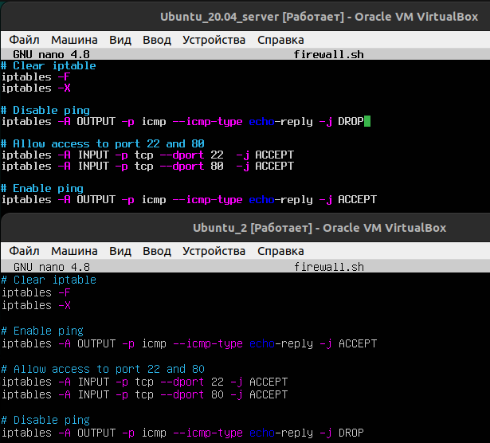
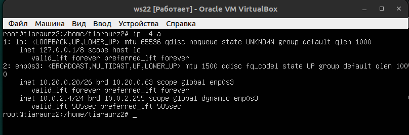
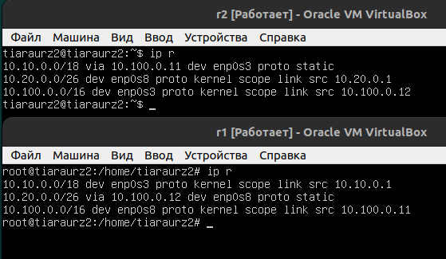
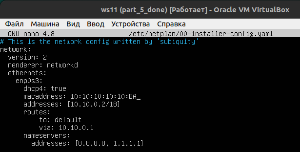
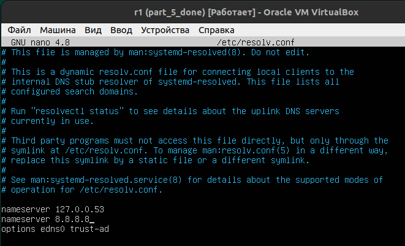
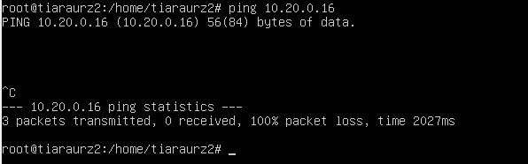
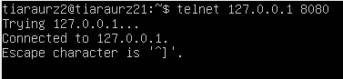

## Part 1. Инструмент ipcalc
### 1.1. Сети и маски

-  
Установка утилиты **ipcalc**
  
-  
Адрес сети: 192.160.0.0/13
-  
перевод маски 255.255.255.0 в префиксную и двоичную запись: 
    - префиксная: 24
    - двоичная: 11111111.11111111.11111111.00000000

-  
перевод маски /15 в обычную и двоичную:
    - обычная: 255.254.0.0
    - двоичная: 11111111.11111110.00000000.00000000

-   
перевод маски 11111111.11111111.11111111.11110000 в обычную и префиксную:
    - обычная: 255.255.255.240
    - префиксная: 28
- минимальный и максимальный хост в сети 12.167.38.4 при масках:
    - /8:   
    - 11111111.11111111.00000000.00000000:   
    - 255.255.254.0:   
    - /4:   

### 1.2. localhost
Определить и записать в отчёт, можно ли обратиться к приложению, работающему на localhost, со следующими IP: 
- На следующих скриншотах видно, какие из адресов относятся к сети localhost:\
 
 
    - 194.34.23.100: нет
    - 127.0.0.2: да 
    - 127.1.0.1: да
    - 128.0.0.1: нет

### 1.3. Диапазоны и сегменты сетей
1. 
    - публичные: 134.43.0.2, 172.0.2.1, 192.172.0.1, 172.68.0.2, 192.169.168.1
    - частные: 10.0.0.45, 192.168.4.2, 172.20.250.4, 172.16.255.255, 10.10.10.10 
2. 
    - какие из перечисленных IP адресов шлюза возможны у сети 10.10.0.0/18: 10.0.0.1, 10.10.0.2, 10.10.10.10, 10.10.100.1, 10.10.1.255
    - Ответ: 10.10.0.2, 10.10.10.10, 10.10.1.255

## Part 2. Статическая маршрутизация между двумя машинами
- Сетевые интерфейсы *ws1* (команда **ip a**)\
 
- Сетевые интерфейсы *ws2* (команда **ip a**)\
 

- Адреса и маски: ws1 - 192.168.100.10, маска /16, ws2 - 172.24.116.8, маска /12:\
 

- Команда **netplan apply** для перезапуска сервиса сети:\
 

### 2.1. Добавление статического маршрута вручную
- Настройка статического маршрута вручную *ws1*\
 
- Настройка статического маршрута вручную *ws2*\
 

### 2.2. Добавление статического маршрута с сохранением
- Добавление статического маршрута от одной машины до другой с помощью файла /etc/netplan/00-installer-config.yaml:\
 
- Проверка соединения между машинами:\
 

## Part 3. Утилита iperf3
### 3.1. Скорость соединения
- 8 Mbps = 1 MB/s
- 100 MB/s = 800000 Kbps
- 1 Gbps = 1000 Mbps

### 3.2. Утилита iperf3
- Установить утилиты на обоих машинах\
 

- На одной из машин запустить iperf3 в режиме сервера, который будет слушать входящие соединения и отвечать на них. Для этого ввести команду:\
**iperf3 -s**\
 

- На другой машине запустить iperf3 в режиме клиента и указать адрес сервера. Для этого ввести команду:\
**iperf3 -c <ip-адрес сервера>**\
 

- Cкорость соединения между ws1 и ws2:
 1.32 Gbits/sec

- По умолчанию, iperf3 будет отправлять данные на сервер в течение 10 секунд и затем выводить отчет о скорости передачи данных. Если нужно изменить время передачи данных, можно использовать флаг -t и указать желаемое время в секундах. Например, чтобы отправить данные в течение 30 секунд:
**iperf3 -c 192.168.100.10 -t 30**

- Результаты скорости передачи данных  отображаются в столбце Bitrate после завершения теста. Можно получить более подробный отчет о тесте, используя определенные опции командной строки, такие как -r или -R.

## Part 4. Сетевой экран
### 4.1. Утилита iptables
- Ключи **iptables**:\
    - -A: добавить правило в конец цепочки
    - -C: проверить существование правила в цепочке
    - -D: удалить правило из цепочки
    - -E: изменить имя пользовательской цепочки
    - -F: очистить цепочку от всех правил
    - -I: вставить правило в начало цепочки
    - -L: вывести список правил в цепочке
    - -N: создать новую пользовательскую цепочку
    - -X: удалить пользовательскую цепочку
    - -Z: сбросить счетчики пакетов и байтов для всех правил в цепочке
    - -P: установить политику по умолчанию для цепочки
    - -p: указать протокол (tcp, udp, icmp и т.д.)
    - -s: указать исходный IP-адрес
    - -d: указать целевой IP-адрес
    - --sport: указать исходный порт
    - --dport: указать целевой порт
    - -j: указать целевое действие (ACCEPT, DROP, REJECT и т.д.)
    - -i: указать сетевой интерфейс входящего трафика
    - -o: указать сетевой интерфейс исходящего трафика
    - -m: указать модуль расширения (например, mod_tcpudp для фильтрации по портам TCP и UDP)
    - -v: выводить детальную информацию о правилах
    - -h: вывести справку о команде

- Посмотреть состояние iptables:\
**sudo iptables -L -nv**
- Посмотреть состояние таблицы:\
**sudo iptables -t <имя таблицы> -L -nv**
- Файл /etc/firewall.sh, имитирующий фаерволл, на ws1 и ws2:\
 
- Запуск файлов firewall.sh:\
 
- Состояние таблицы filter:\
 
- Машина ws1 не сможет отправлять echo-reply пакеты, но сможет принимать их, тогда как машина ws2 сможет отправлять эти пакеты, но не сможет принимать их.

- В обоих случаях отрабатывается верхнее правило (DROP для ws1 и ACCEPT для ws2). 

- Если пакет соответствует только верхнему правилу в цепочке, то будет выполнено только это правило. Однако, если пакет соответствует нескольким правилам в цепочке, то будет выполнено только первое правило, которое соответствует пакету.

- Если нужно, чтобы пакет, соответствующий более чем одному правилу, был обработан несколькими правилами, можно использовать цепочки пользовательского определения (user-defined chains) в iptables, где каждое правило может перенаправлять пакеты в другие цепочки.

### 4.2. Утилита nmap

- Командой ping находим машину, которая не "пингуется", после чего утилитой nmap показываем, что хост машины запущен:\
 
- В выводе nmap сказано: *Host is up*
- Сохранение дампа образа виртуальной машины ws1\
 

- Сохранение дампа образа виртуальной машины ws2\
 

## Part 5. Статическая маршрутизация сети
- Пять виртуальных машин (3 рабочие станции (ws11, ws21, ws22) и 2 роутера (r1, r2)):\
 

### 5.1. Настройка адресов машин
- файл etc/netplan/00-installer-config.yaml для r1:\
 

- файл etc/netplan/00-installer-config.yaml для r2:\
 

- файл etc/netplan/00-installer-config.yaml для ws11:\
 

- файл etc/netplan/00-installer-config.yaml для ws21:\
 

- файл etc/netplan/00-installer-config.yaml для ws22:\
 

- Перезапуск сервиса сети на каждой машине следующей командой:\
 

- Командой ip -4 a проверяем, что адрес машины r1 задан верно:\
 

- Командой ip -4 a проверяем, что адрес машины r2 задан верно:\
 

- Командой ip -4 a проверяем, что адрес машины ws11 задан верно:\
 

- Командой ip -4 a проверяем, что адрес машины ws21 задан верно:\
 

- Командой ip -4 a проверяем, что адрес машины ws22 задан верно:\
 

- Пропинговать ws22 с ws21:\
 

- Пропинговать r1 с ws11:\
 

### 5.2. Включение переадресации IP-адресов

- Включения переадресации IP до конца сессии:\
 

- Включения переадресации IP на постоянной основе:\
    - для r1:\
     
    - для r2:\
     

### 5.3. Установка маршрута по-умолчанию
- Настройка маршрута по умолчанию для рабочих станций:
    - ws11:\
     
    - ws21:\
     
    - ws22:\
     

- Маршрут добавился в таблицу маршрутизации, проверим это командой **ip r**:\
 

- Пропингуем с ws11 роутер r2:\
 

- Используем команду **tcpdump -tn -i eth1**, что бы посмотреть, что пинг доходит:\
 

### 5.4. Добавление статических маршрутов

- Cтатические маршруты в файле конфигураций:
    - r1:\
     
    - r2:\
     
    
- Таблицы с маршрутами на r1 и r2:\
 

- Запустить команды на ws11:\
**ip r list 10.10.0.0/[маска сети]** и **ip r list 0.0.0.0/0**\
 
- Для адреса 10.10.0.0/[маска сети] был выбран маршрут, отличный от 0.0.0.0/0, потому что он является более специфическим. 0.0.0.0/0 (маршрут по умолчанию) используется, если не было найдено других подходящих маршрутов для перенаправления трафика.

### 5.5. Построение списка маршрутизаторов
- Вызов **tcpdump**:\
 

- Вывод **tcpdump**:\
 

- Вызов и вывод **traceroute**:\
 

- Traceroute отправляет пакеты с различными значениями TTL (Time to Live), начиная с 1 (по 3 раза каждый пакет, что бы уменьшить погрешность во времени, которая может возникнуть, например, из за нагрузки сети), и записывает IP-адреса промежуточных маршрутизаторов, через которые проходят эти пакеты. Когда TTL пакета истекает (декремент на каждом маршрутизаторе), маршрутизатор отправляет обратно ICMP-сообщение "Time Exceeded" отправителю, который затем использует эту информацию, чтобы определить IP-адрес маршрутизатора на пути до конечного узла.\
Анализируя вывод команды дампа на r1, можно увидеть, какие пакеты проходят через интерфейс enp0s3 маршрутизатора. В выводе отображаются исходный и назначенный IP-адреса, номера портов, длина пакета и т.д. Анализируя эту информацию, можно понять, какие пакеты проходят через маршрутизатор и на каком этапе пути они находятся.

### 5.6. Использование протокола ICMP при маршрутизации

- Пропинговать с ws11 несуществующий IP:\
**ping -c 1 10.30.0.11**\
 

- На r1 перехват сетевого трафика:\
 

## Part 6. Динамическая настройка IP с помощью DHCP

- Для r2 настроить в файле /etc/dhcp/dhcpd.conf конфигурацию службы DHCP:\
    - dhcpd.conf адрес маршрутизатора по-умолчанию, DNS-сервер и адрес внутренней сети:\
     
    - resolv.conf прописать nameserver 8.8.8.8:\
     

- Перезагрузить службу DHCP командой systemctl restart isc-dhcp-server:\
     
- Машину ws21 перезагрузить при помощи reboot:\
     
- Через ip a показать, что она получила адрес. Также пропинговать ws22 с ws21:\
     

- MAC адрес у ws11, etc/netplan/00-installer-config.yaml, добавляем строки: macaddress: 10:10:10:10:10:BA, dhcp4: true:\
     

    
- Для r1 настроить в файле /etc/dhcp/dhcpd.conf конфигурацию службы DHCP:\
    - dhcpd.conf адрес маршрутизатора по-умолчанию, DNS-сервер и адрес внутренней сети:\
     
    - Cделать выдачу адресов с жесткой привязкой к MAC-адресу:\
     
    - resolv.conf прописать nameserver 8.8.8.8:\
     

- Перезагрузить службу DHCP командой systemctl restart isc-dhcp-server:\
     

- Машину ws11 перезагрузить при помощи reboot:\
     
- Через ip a показать, что она получила адрес. Также пропинговать ws11 с ws22:\
     

- Запросить с ws21 обновление ip адреса и посмотреть адрес до и после командой **ip a**:\
     
 

- Когда вы запускаете команду dhclient или когда загружаете компьютер, dhclient отправляет широковещательные сообщения (DHCP Discover) в подсети для обнаружения доступных DHCP-серверов. Пакет DHCP Discover включает в себя MAC-адрес физического компьютера для клиента, который будет идентифицирован сервером. Затем сервер DHCP отправляет ответ (ПРЕДЛОЖЕНИЕ DHCP) с предложением отправить IP-адрес. Клиент отвечает пакетом запроса или запросом DHCP, принимая предложение. Затем DHCP-сервер назначает клиенту IP-адрес, интегрируя его в сеть. Этот процесс известен как согласование DHCP.\
Что касается пакетов, мы можем резюмировать этот процесс как DHCPDISCOVER> DHCPOFFER> DHCPREQUEST> DHCPACK, где:\
DHCPDISCOVER: клиент отправляет пакет в подсети в поисках доступных DHCP-серверов для получения IP-адреса.\
DHCPOFFER: когда пакет получен DHCP-сервером, сервер отправляет сообщение DHCPOFFER обратно клиенту, идентифицированному его MAC-адресом, а затем предлагает назначить ему свободный или неиспользуемый IP-адрес.\
DHCPREQUEST: клиент отправляет пакет DHCP-серверу, принимая предложение. Если более одного DHCP-сервера предлагали IP-адрес, клиент примет первый полученный, а другие DHCP-серверы будут уведомлены о том, что первоначальный запрос уже был удовлетворен.\
DHCPACK: Наконец, после того, как DHCP-сервер получил последний пакет запроса от клиента. Он ответит пакетом DHCPACK, завершающим назначение IP.

- Опции, которыми пользуется DHCP сервер при запросе на смену IP от клиента (используется команда **sudo tcpdump -i enp0s3 -vvv port 67 or port 68 -e -n**):\
     

- Список опций, которые использует DHCP-сервер и их значение:

    - Server-ID Option 54: IP-адрес DHCP-сервера - 10.20.0.1
    - Requested-IP Option 50: запрошенный клиентом IP-адрес - 10.20.0.15
    - Hostname Option 12: имя компьютера клиента - "tiaraurz2"
    - Subnet-Mask Option 1: маска подсети - 255.255.255.192
    - Default-Gateway Option 3: IP-адрес шлюза по умолчанию - 10.20.0.1
    - Domain-Name Option 15: имя домена - "example.org"
    - Domain-Name-Server Option 6: IP-адрес DNS-сервера - 10.20.0.1
    - Lease-Time Option 51: время аренды IP-адреса - 600 секунд
    - OHCP-Message Option 53: тип сообщения DHCP-протокола - Request или ACK
    - Parameter-Request (Option 55): список запрошенных параметров, включая маску подсети, шлюз по умолчанию, DNS-серверы и другие;
    - Опция 255 с кодом 0xFF является специальной опцией "END", которая указывает на конец списка опций. Она используется для указания, что больше опций в данном сообщении DHCP не будет.
    - Опция 0 с кодом 0x00 - это опция "PAD" (заполнитель), которая используется для выравнивания опций в сообщении DHCP до кратности 4 байтам. Она состоит только из нулевых байтов и не имеет полезной информации.

## Part 7. NAT
- Когда в конфигурационном файле Apache была указана строка "Listen 80", это означало, что сервер Apache слушает входящие соединения на порту 80 только на одном конкретном сетевом интерфейсе (обычно это был локальный интерфейс - 127.0.0.1). Это ограничивало возможности сервера Apache и могло привести к тому, что клиенты не могли бы подключиться к серверу Apache с других компьютеров в сети.
Когда в конфигурационном файле Apache указывается строка "Listen 0.0.0.0:80", это означает, что сервер Apache будет слушать входящие соединения на порту 80 на всех доступных сетевых интерфейсах, включая локальный интерфейс и внешние интерфейсы, если они настроены на сервере. Это позволяет клиентам подключаться к серверу Apache с других компьютеров в сети и расширяет возможности сервера Apache.
Сделаем Apache общедоступным на ws22 и r1:\
 

- Запустить веб-сервер Apache командой **service apache2 start** на ws22 и r1:\
 

- Добавить в фаервол на r2 следующие правила:
    1) Удаление правил в таблице filter - iptables -F
    2) Удаление правил в таблице "NAT" - iptables -F -t nat
    3) Отбрасывать все маршрутизируемые пакеты - iptables --policy FORWARD DROP
     

- Запускаем командой **./firewall.sh**
- Проверка соединения командой ping между ws22 и r1:
    - До запуска firewall на r2:\
     
     
    - После запуска firewall на r2:\
     
     

- Разрешить маршрутизацию всех пакетов протокола ICMP на r2:\
     

- Проверка соединения командой ping между ws22 и r1:\
     
     

- SNAT и DNAT правила:\
     

- Проверка через telnet:\
     

## Part 8. Дополнительно. Знакомство с SSH Tunnels

- Запустить на r2 фаервол с правилами из Части 7:\
     

- Запустить веб-сервер Apache на ws22 только на localhost:\
     

- Воспользоваться Local TCP forwarding с ws21 до ws22, чтобы получить доступ к веб-серверу на ws22 с ws21 (локальный порт: 8080):\
     

- Чтобы осуществить проброс портов, потребуется создание SSH tunnel. Для этого в локальной системе открывается порт, а для создания канала связи пользователь должен выбрать порт на другом конце туннеля.\
Команда устанавливает прослушку на порт 8080. Порт 80 используется для проброса.

- Проверка подключения командой **telnet 127.0.0.1 8080** на ws21:\
     

- Воспользоваться Remote TCP forwarding c ws11 до ws22, чтобы получить доступ к веб-серверу на ws22 с ws11 (на ws22 вводим команду):\
     

- Удаленное TCP-пробрасывание (remote TCP forwarding) - это метод перенаправления TCP-трафика через зашифрованное соединение, используя протокол SSH. Это может быть полезным, когда вам нужно получить доступ к сервису, который работает на удаленном сервере, и этот сервис не доступен напрямую из-за ограничений на маршрутизации или защиты.\
Для использования удаленного TCP-пробрасывания вы должны установить SSH-соединение с удаленным сервером с опцией -R (remote port forwarding). Например, если вы хотите получить доступ к веб-серверу на порту 80 на удаленном сервере, вы можете использовать следующую команду:\
**ssh -R 3001:localhost:80 user@remote_server**\
Эта команда привяжет порт 3001 на удаленном сервере к порту 80 на локальном сервере (localhost), где запущен SSH-клиент.

- Проверка подключения на ws11:\
     